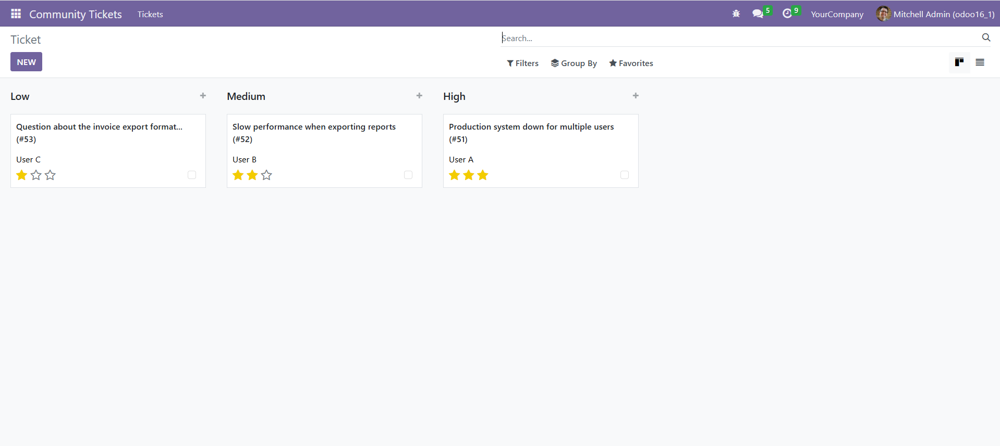
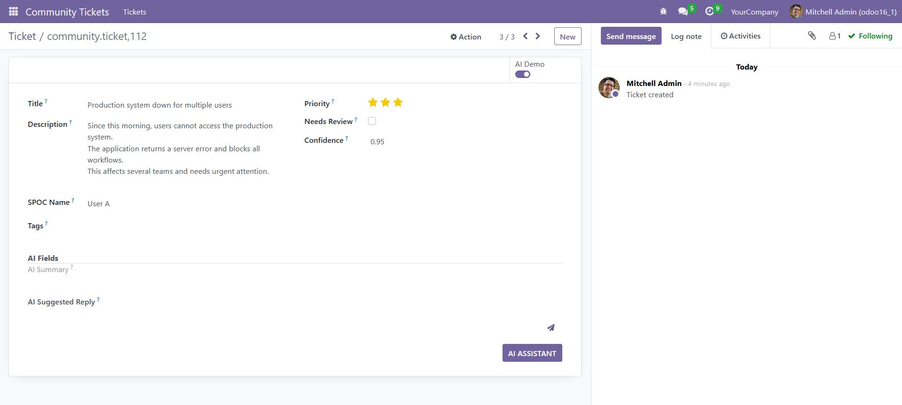
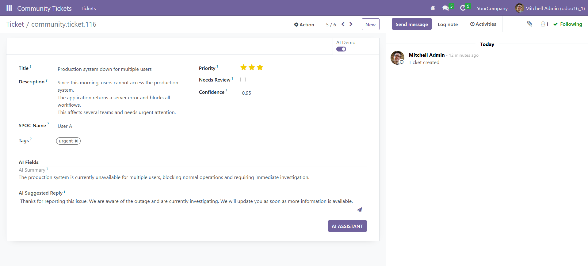
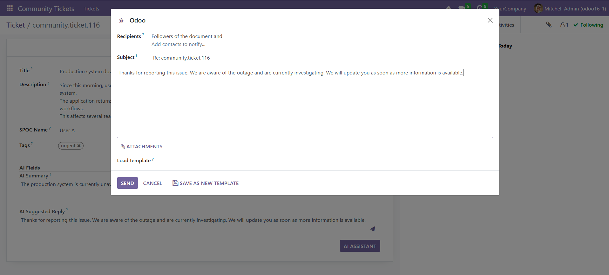

# Community Ticket AI Assistant


## What

An Odoo module that helps project managers and support teams **sort tickets by priority** and **get AI help for long or complex tickets**, without automatic sending or hidden automation.

Main features:

* priority classification on ticket creation (demo/mock mode)
* AI-generated ticket summary and suggested reply (manual)
* human-controlled sending via Odoo email composer
* kanban-friendly priority visualization

---

## Why

When many tickets arrive at the same time, the main problem is **deciding where to start**.

If everything looks the same:

* important tickets are harder to spot
* long tickets take time just to understand
* writing first replies slows down work

This module reduces that friction by:

* visually sorting tickets by priority
* helping summarize long tickets
* suggesting replies **only when the user asks for it**

---

## Where

* Odoo backend (Form, Tree, Kanban views)
* Works with `mail.thread`
* Designed for internal project management / support workflows

No external tools or copy-pasting outside Odoo is required.

---

## When

### On ticket creation

If **Demo / Mock mode** is enabled:

* priority is assigned based on title, description, and tags
* no AI API calls are made
* fast and cheap

### On user action

When the PM clicks ** AI Assistant **:

* AI generates a summary
* AI suggests a reply
* nothing is sent automatically

---

## Who

* Project Managers
* Support Leads
* Odoo partners handling many customer tickets

The AI assists, but **the human always decides**.

---

## Installation

1. Copy the module into your `custom_addons` directory:

   ```bash
   custom_addons/community_ticket_ai
   ```

2. Install Python dependency:

   ```bash
   pip install openai
   ```

3. Restart Odoo and update the module:

   ```bash
   python odoo-bin -d your_db -u community_ticket_ai
   ```

---

## Configuration

### Optional (for AI assistant)

Set the OpenAI API key as an Odoo system parameter:

* **Key:** `community_ticket_ai.openai_api_key`
* **Value:** your API key

You can also set:

* `COMMUNITY_TICKET_AI_MODEL` (default: `gpt-4o-mini`)
* `COMMUNITY_TICKET_AI_THRESHOLD` (default: `0.60`)

---

## Usage

1. Create a ticket
2. If Demo mode is enabled:

   * priority is assigned automatically
   * The confidence score reflects how strong the detected signals were.
     Tickets marked as Needs review should be checked manually before acting on the priority.
3. Open a ticket
4. Click **AI Assistant** to:
   * generate a summary
   * generate a suggested reply
5. Click the send icon to open the Odoo email composer
6. Edit and send manually

---

## Known Limitations / Roadmap

* Demo mode keyword logic is rule-based (by design)
* AI assistant requires an API key and quota
* No automatic sending (intentional)

Possible future improvements:

* per-project keyword configuration
* usage statistics for AI actions
* optional routing suggestions

---

## Technical Notes

* Odoo version: 16.0
* Uses `mail.thread` and `mail.compose.message`
* External API: OpenAI (manual trigger only)
* Mock and AI modes are fully independent

---

## Screenshots

**Priority overview (kanban)**  


**Automatic priority on creation (demo mode)**  


**AI-generated summary and reply**  


**Manual sending via Odoo composer**  



## Credits

Author: *Rana Alorfali*

Purpose: learning project 

---
